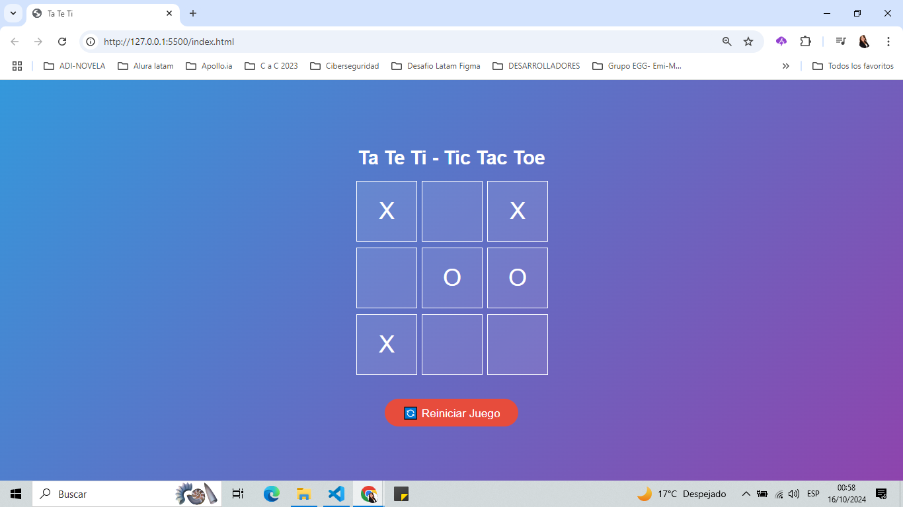

# 🎮 App - Ta Te Ti 

¡Bienvenidos a **Ta Te Ti**! Este es un simple juego de Ta Te Ti desarrollado con **HTML**, **CSS** y **JavaScript**. El diseño es responsive y está optimizado para jugar en dispositivos móviles. 📱

## 🚀 Características

- **Responsive**: El juego está optimizado para móviles, pero también funciona en pantallas grandes.
- **Modal Pop-up**: Muestra un mensaje emergente cuando un jugador gana o cuando hay un empate.
- **Reinicio Sofisticado**: Un botón estilizado para reiniciar la partida, ¡con un toque moderno! 🔄
- **Degradado Moderno**: El fondo tiene un degradado elegante de colores vivos. 🎨

## 🛠️ Tecnologías Utilizadas

- **HTML5**: Estructura básica del juego.
- **CSS3**: Estilización con diseño responsivo y efectos visuales.
- **JavaScript**: Lógica del juego y control de la interacción del usuario.

## 📷 Capturas de Pantalla

()

## 🕹️ Cómo Jugar

1. Selecciona una celda en el tablero para colocar tu símbolo (**X** o **O**).
2. Alterna entre jugadores hasta que alguien gane o se dé un empate.
3. Al final de la partida, aparecerá un mensaje que indica el ganador o un empate.
4. Haz clic en el botón **Reiniciar Juego** para comenzar una nueva partida. 🔁

## 🎯 Objetivo

Ganar alineando 3 símbolos iguales (ya sea **X** o **O**) en una fila, columna o diagonal.

## 🔧 Cómo Instalar y Ejecutar el Proyecto

1. Clona este repositorio:
   
   git clone https://github.com/SILVIAGONZALEZ1/App-tateti
